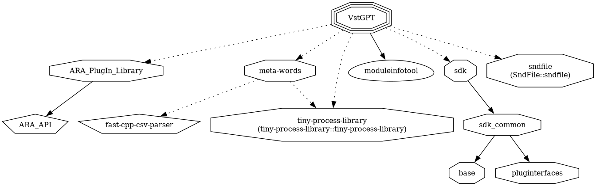

# VST 3 GPT Plug-In
[](https://github.com/rehans/vst-gpt/actions/workflows/cmake.yml)

## Clone and Build

```cmd
git clone https://github.com/max-and-me/vst-gpt
mkdir build
cd build
cmake -DCMAKE_BUILD_TYPE=Debug ../<repo_name>
cmake --build .
```

## Dependency Graph



### How to generate

```shell
cmake --build . --target VstGPT-dependency-graph
cd graphviz
dot -Tpng -O ./VstGPT.dot.VstGPT
cp ./VstGPT.dot.VstGPT.png ../../vst-gpt/doc    
```

Copy the generated ```VstGPT.dot.VstGPT.png``` into the ```doc``` folder.

> TODO: Automate this!!


## How to whisper

How to use the whisper library:

```sh
git clone https://github.com/ggerganov/whisper.cpp.git
mkdir build
cd build
cmake -DCMAKE_BUILD_TYPE=Debug ../whisper.cpp
cmake --build . --parallel
../whisper.cpp/models/download-ggml-model.sh base.en
cd bin
./main -m ../../whisper.cpp/models/ggml-base.en.bin -f ../../whisper.cpp/samples/jfk.wav -ml 1
```

> See also: https://github.com/ggerganov/whisper.cpp