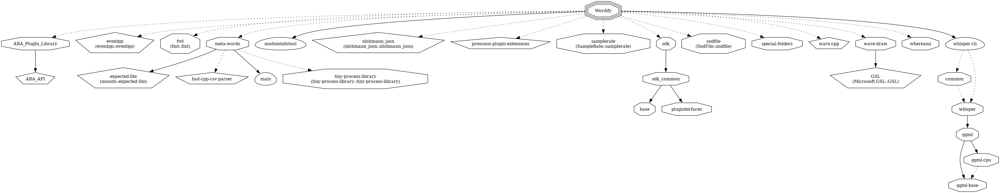

# Wordify VST 3 Plug-In (ARA)

[](https://github.com/max-and-me/wordify-plugin/actions/workflows/cmake.yml)

Wordify is an ARA / VST 3 plug-in. It transcribes (speech to text) selected clips from the project in a chat-like manner. Clicking on a word, locates to the time position where the word is spoken. An intelligent search makes it possible to quickly find spoken words in clips.


## Getting Started

To clone and create the project, open a command prompt and proceed as follows:

### Windows

```sh
git clone https://github.com/max-and-me/wordify-plugin.git
mkdir build
cd build
cmake ../wordify-plugin
cmake --build .
```

### macOS

```sh
git clone https://github.com/max-and-me/wordify-plugin.git
mkdir build
cd build
cmake -GXcode ../wordify-plugin
cmake --build .
```

### Linux

```sh
git clone https://github.com/max-and-me/wordify-plugin.git
mkdir build
cd build
cmake -DCMAKE_BUILD_TYPE=Debug ../wordify-plugin
cmake --build .
```

As soon as the project has been successfully built, you will find the plugin bundle in the build folder: ```Debug/VST3/Wordify.vst3```

### Installer

Build the project in ```Release``` configuration:

CPack is configured to work with the following Generators:

* Windows: ```INNOSETUP```
* macOS: ```productbuild```
* Linux: ```TGZ```

Execute CPack inside the CMake binary directory the ```project```. 

```sh
cpack -C Release -G <CPack_Generator> .
```

### Setup whisper's AI model environment

Wordify needs OpenAI's whisper library and AI models to work. It searches for the models in different locations depending on wether it is build in ```Debug``` or ```Release```.

Location in ```Debug``` on:
* all platforms ```/<path_to>/build/_deps/meta-words-build/whisper.cpp/models/ggml-base.en.bin```

Location in ```Release``` on:
* macOS  : ```/Library/Application Support/WordifyOrg/Wordify/ModelData/ggml-medium.bin```
* Windows: ```C:\ProgramData\WordifyOrg\Wordify\ModelData\ggml-medium.bin```
* Linux  : ```/home/<user>/WordifyOrg/Wordify/ModelData/ggml-medium.bin```

> In ```Debug``` it uses the small and more inaccurate model ```ggml-base.en.bin``` to speed up debugging as whisper can get quite slow. 

> Run the installer first when you want to build and run the ```Release``` version locally. Otherwise Wordify will not find the model. It needs to be installed first.

## Dependency Graph



```shell
cmake --build . --target Wordify-dependency-graph
cd graphviz
dot -Tpng -O ./Wordify.dot.Wordify
cp ./Wordify.dot.Wordify.png ../../wordify/doc    
```

Copy the generated ```Wordify.dot.Wordify.png``` into the ```doc``` folder.

> TODO: Automate this!!

## How to whisper

How to use the whisper library:

```sh
git clone https://github.com/ggerganov/whisper.cpp.git
mkdir build
cd build
cmake -DCMAKE_BUILD_TYPE=Debug ../whisper.cpp
cmake --build . --parallel
../whisper.cpp/models/download-ggml-model.sh base.en
cd bin
./main -m ../../whisper.cpp/models/ggml-base.en.bin -f ../../whisper.cpp/samples/jfk.wav -ml 1
```

> See also: https://github.com/ggerganov/whisper.cpp

## Getting Help

* https://vstdev.org
* https://github.com/ggerganov/whisper.cpp